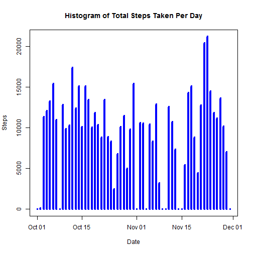
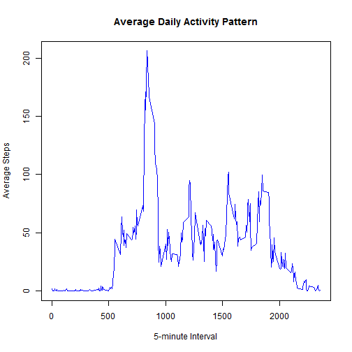
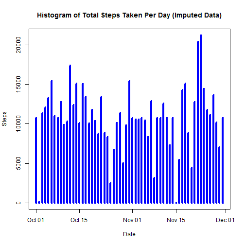
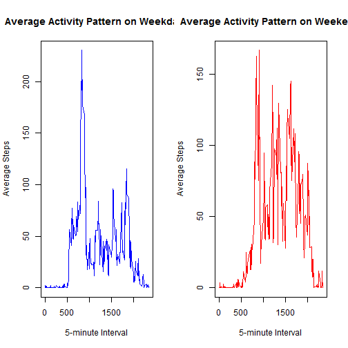

## Introduction

It is now possible to collect a large amount of data about personal
movement using activity monitoring devices such as a
[Fitbit](http://www.fitbit.com), [Nike
Fuelband](http://www.nike.com/us/en_us/c/nikeplus-fuelband), or
[Jawbone Up](https://jawbone.com/up).
This assignment makes use of data from a personal activity monitoring
device. This device collects data at 5 minute intervals through out the
day. The data consists of two months of data from an anonymous
individual collected during the months of October and November, 2012
and include the number of steps taken in 5 minute intervals each day.


## Data Source and Data Download

The data for this assignment can be downloaded from the course web
site:

* Dataset: [Activity monitoring data](https://d396qusza40orc.cloudfront.net/repdata%2Fdata%2Factivity.zip) [52K]

The dataset is stored in a comma-separated-value (CSV) file and there
are a total of 17,568 observations in this
dataset.

The variables included in this dataset are:

* **steps**: Number of steps taking in a 5-minute interval (missing
    values are coded as `NA`)

* **date**: The date on which the measurement was taken in YYYY-MM-DD
    format

* **interval**: Identifier for the 5-minute interval in which
    measurement was taken


## Loading and Preprocessing the Data

After the data is downloaded from the source, and unzip to a .csv
file in the current working directory, the data can be loaded into
R with the R function read.csv().


```r
fileName <- "./activity.csv"
activityData <- read.csv(fileName, header=TRUE, sep=",", stringsAsFactors=FALSE, na.strings=c("NA", "-", " ", "?"))
par(mfrow = c(1,1))
```

Next we transform the read in date (as string) into R Date format for later analysis.


```r
activityData$date <- as.Date(activityData$date, format="%Y-%m-%d") 
```

## What is Mean Total Number of Steps Taken Per Day?

For this part of analysis, we ignore the missing values in the dataset.

1. compute and make a histogram of the total number of steps taken each day


```r
stepsPerDay <- tapply(activityData$steps, format(activityData$date, "%Y-%m-%d"), sum, na.rm=TRUE)

dates <- as.Date(names(stepsPerDay), format="%Y-%m-%d")

plot(dates, stepsPerDay, type="h", col = "blue", lwd = 4, main="Histogram of Total Steps Taken Per Day", xlab="Date", ylab="Steps")
```

 

2. Calculate and report the **mean** and **median** total number of steps taken per day


```r
stepsMean   <- mean(stepsPerDay, na.rm=TRUE)
stepsMedian <- median(stepsPerDay, na.rm=TRUE)
print(stepsMean)
```

```
## [1] 9354.23
```

```r
print(stepsMedian)
```

```
## [1] 10395
```

So the **mean** and **median** total number of steps taken per day are
9354.23 and 10395, respectively.

## What is the Average Daily Activity Pattern?

We willload the plyr library to help analyzing the data.


```r
library(plyr)
```

Two questions we can answere from the data are following.

1. Make a time series plot (i.e. `type = "l"`) of the 5-minute interval (x-axis) and the average number of steps taken, averaged across all days (y-axis)


```r
averagePattern <- ddply(activityData, c("interval"), summarize, average = mean(steps, na.rm=TRUE))

plot(averagePattern$interval, averagePattern$average, type="l", col = "blue", main="Average Daily Activity Pattern", xlab="5-minute Interval", ylab="Average Steps")
```

 

2. Which 5-minute interval, on average across all the days in the dataset, contains the maximum number of steps?


```r
averagePattern[which.max(averagePattern$average),]
```

```
##     interval  average
## 104      835 206.1698
```

Therefore, the 5-minute interval 835 has the maximum number of 206 steps on average. 


## Imputing Missing Values

There are a number of days/intervals where there are missing
values (coded as `NA`). The presence of missing days may introduce
bias into some calculations or summaries of the data. We will 
fill in  missing values with average values, and redo the analysis 
perfomed in the previous sections, and compare the results.

1. Calculate and report the total number of missing values in the dataset (i.e. the total number of rows with `NA`s)


```r
rowIdx<- which(is.na(activityData$steps))
numNA <- length(rowIdx)
print(numNA)
```

```
## [1] 2304
```

2. We use the mean for that 5-minute interval to fill in all of the missing values in the dataset.


```r
imputedData <- activityData

for (i in 1:numNA) {
    k <- rowIdx[i]
    j <- which(averagePattern$interval == imputedData$interval[k])
    imputedData$steps[k] = round(averagePattern$average[j])
}
```

3. Create a new dataset that is equal to the original dataset but with the missing data filled in.

The data frame imputeData created in the previous step contain values
from the original dataset but with the missing data filled in.

4. Make a histogram of the total number of steps taken each day and Calculate and report the **mean** and **median** total number of steps taken per day. Do these values differ from the estimates from the first part of the assignment? What is the impact of imputing missing data on the estimates of the total daily number of steps?


```r
stepsPerDay2 <- tapply(imputedData$steps, format(imputedData$date, "%Y-%m-%d"), sum)
dates2 <- as.Date(names(stepsPerDay2), format="%Y-%m-%d")
plot(dates2, stepsPerDay2, type="h", col = "blue", lwd = 4, main="Histogram of Total Steps Taken Per Day (Imputed Data)", xlab="Date", ylab="Steps")
```

 

The **mean** and **median** total number of steps taken per day of the imputed data can be computed as follows.


```r
stepsMean2   <- mean(stepsPerDay2)
stepsMedian2 <- median(stepsPerDay2)
print(stepsMean2)
```

```
## [1] 10765.64
```

```r
print(stepsMedian2)
```

```
## [1] 10762
```

We can compare the **mean** and **median** total number of steps taken per day before and after data imputing.


```r
stepsMean2 - stepsMean
```

```
## [1] 1411.41
```

```r
stepsMedian2 - stepsMedian
```

```
## [1] 367
```
We see that the mean increas by 1141 steps and the median increases by 367 steps. We can also calculate the differences in **mean** and **median** before and after data imputing


```r
stepsMedian - stepsMean
```

```
## [1] 1040.77
```

```r
stepsMedian2 - stepsMean2
```

```
## [1] -3.639344
```

We see **mean** and **median** are closer to each other after data imputing.


## Are There Differences in Activity Patterns Between Weekdays and Weekends?

To answer this question, we add a new factor variable to the imputed dataset with two levels - "weekday" and "weekend" indicating whether a given date is a weekday or weekend day.


```r
for ( i in 1:nrow(imputedData)) {
    if ( weekdays(imputedData$date[i]) %in% c("Saturday", "Sunday")) {
        imputedData$day[i] <- "weekend"            
    }
    else {
        imputedData$day[i] <- "weekday" 
    }
}

imputedData$day <- as.factor(imputedData$day)
```

Then we summarize the daily activity patterns for weekday days and for weekend days.


```r
dayPattern <- ddply(imputedData, c("interval","day"), summarize, average=mean(steps, na.rm=TRUE))

weekdayPattern <- subset(dayPattern, day == "weekday", select = c(interval, average))
weekendPattern <- subset(dayPattern, day == "weekend", select = c(interval, average))
```

Then we make a panel plot containing a time series plot of the 5-minute interval (x-axis) and the average number of steps taken, averaged across all weekday days or weekend days (y-axis). Put the charts side-by-side for easy comparison.


```r
par(mfrow = c(1,2))
plot(weekdayPattern$interval, weekdayPattern$average, type="l", col = "blue", main="Average Activity Pattern on Weekdays", xlab="5-minute Interval", ylab="Average Steps")
plot(weekendPattern$interval, weekendPattern$average, type="l", col = "red", main="Average Activity Pattern on Weekend", xlab="5-minute Interval", ylab="Average Steps")
```

 

From the panel plots, it is easy to conclude that there are more activities on weekend days than on weekday days.


